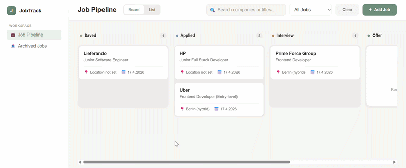
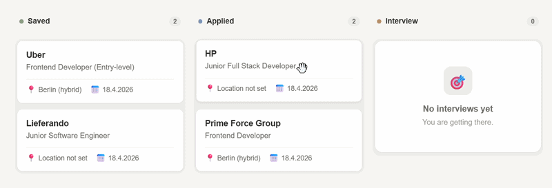
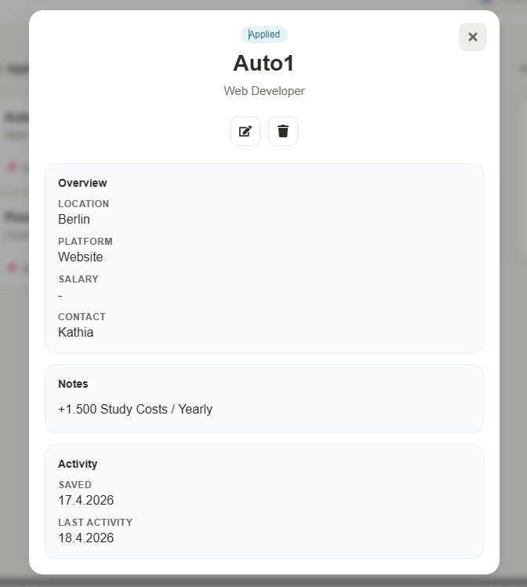
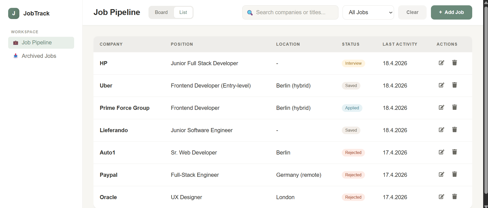
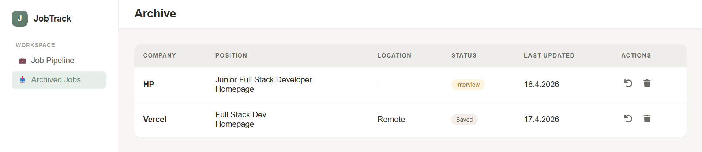

# Job Tracker App

A full-stack job application tracker built from scratch to manage and visualize the entire job search process.

This is my first fully self-directed project after completing a software engineering program, focusing on real-world architecture, API design, and product-level UX decisions.

## Overview

This application helps users manage their job search by organizing applications across different stages, tracking activity, and keeping all relevant information in one place.

The app includes both a **Kanban board** and a **list view**, along with an **archive system** for managing old applications without losing data.


## Live Demo

- 🌐 Frontend (Vercel): https://job-tracker-five-zeta.vercel.app
- 🔌 Backend API (Render): https://job-tracker-well.onrender.com/

The frontend communicates with the backend via a REST API.

## Preview

### Kanban Board


### Drag & Drop


### Job Details



### Table View



### Archive



## Features

- Full CRUD functionality for managing job applications via REST API
- Kanban board with drag and drop (HTML5 Drag & Drop API)
- Optimistic UI updates with backend synchronization
- Table view for structured comparison and quick scanning
- Detailed job view with structured sections (overview, notes, activity)
- Search and filtering using derived state (no duplicated data)
- Archive system (soft delete with restore + permanent delete)
- Activity tracking via `dateSaved` and `dateUpdated`

## Tech Stack

### Frontend
- React (Vite)
- JavaScript (ES6+)
- Custom CSS (no UI library)
- Axios

### Backend
- Node.js
- Express
- MongoDB Atlas
- Mongoose (schema validation & data modeling)

## Architecture

This project was built as a fully separated full-stack application, with a clear distinction between frontend and backend responsibilities.

### Frontend (client)

- React (Vite) application deployed on Vercel  
- Responsible for UI, state management, and user interactions  
- Uses Axios to communicate with the backend API  
- Centralized state in `App.jsx` as a single source of truth  
- Derived state for filtering and sorting (no duplicated data)  
- Component-driven structure (KanbanBoard, JobTable, JobForm, etc.)

### Backend (server)

- Node.js + Express REST API deployed on Render  
- Handles all data persistence and business logic  
- MongoDB Atlas with Mongoose for schema validation  
- Routes structured around job resources (`/job-applications`)  
- Tracks activity using `dateSaved` and `dateUpdated`  
- Implements soft delete via an `archived` flag  

### Communication

- Frontend and backend are deployed independently  
- Communication happens via a configurable API URL (`VITE_API_URL`)  
- CORS is explicitly configured to allow only the frontend domain  


## Drag & Drop Logic

The Kanban board allows users to move job cards between stages and uses the HTML5 Drag & Drop API.

1. `dragstart`
   - Job ID is stored via `dataTransfer`
   - Local dragging state is set

2. `dragover`
   - Column allows drop via `preventDefault`
   - Active column state is updated for visual feedback

3. `drop`
   - Job ID is retrieved
   - `onMoveJob(jobId, newStatus)` is triggered

4. Optimistic update
   - UI updates immediately
   - `dateUpdated` is set locally

5. Backend sync
   - PUT request persists new status
   - Response replaces local job data

6. Error handling
   - On failure, previous state is restored


## Setup

#### Clone the repository

```bash
  git clone <your-repo-url>
  cd job-tracker
```
#### Install Dependencies

```bash
cd server
npm install

cd ../client
npm install
```

#### Environment variables: 
Create `.env` files: 

#### Client (`client/.env`)
```bash
VITE_API_URL=http://localhost:5000/job-applications
```

#### Server (`server/.env`)
```bash
MONGO_URI=your_mongodb_connection_string  
CLIENT_URL=http://localhost:5173  
PORT=5000  
```

#### Run the App: 

Backend: 
```bash
cd server
npm run dev
```
Frontend: 
```bash
cd client
npm run dev
```

## Deployment

The application is deployed using a decoupled architecture:

- **Frontend**: Vercel (static build with Vite)
- **Backend**: Render (Node.js web service)
- **Database**: MongoDB Atlas

The frontend and backend are deployed independently and communicate via a configurable API endpoint.

Environment variables are used to configure the API URL, allowing the app to connect to a local backend during development and a deployed backend in production. CORS is explicitly configured to restrict access to the frontend domain.

## Design Decisions

- **Separated frontend and backend architecture**  
  Built and deployed independently to reflect a real-world production setup.

- **Single source of truth in React**  
  All state is managed centrally in `App.jsx`, keeping components focused on UI.

- **Derived state over duplication**  
  Filtering and sorting are computed dynamically instead of storing multiple versions of the same data.

- **Optimistic UI updates**  
  UI responds instantly to user actions while syncing with the backend in the background.

- **Soft delete (archive) instead of hard delete**  
  Jobs can be restored before permanent deletion, improving usability and data safety.

## Learnings

- Designing and implementing a full-stack architecture from scratch  
- Managing complex UI state while maintaining a single source of truth  
- Using derived state to avoid unnecessary data duplication  
- Implementing optimistic updates with proper error handling  
- Handling drag & drop interactions without breaking UI behavior  
- Building product-like features such as archive systems instead of basic CRUD  
- Designing and maintaining communication between independently deployed services
